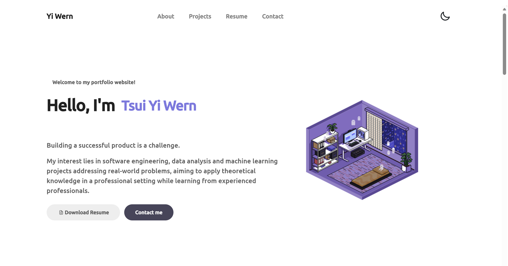

# Tsui Yi Wern Personal Portfolio Website

---

## Description

Welcome to my personal portfolio website! This repository contains the code and assets for my online portfolio, showcasing my skills, projects, and achievements. Whether you're a potential employer, collaborator, or just curious about my work, I'm thrilled to have you here. 🥳

## Language and Tools Used

 
 

 

- **HTML, CSS, and JavaScript**:
The foundation of this portfolio is built upon the trio of web development: HTML for structuring the content, CSS for styling and layout, and JavaScript for interactivity. These languages work seamlessly together to create a dynamic and visually appealing user experience.

- **Bootstrap**:
To ensure a responsive and mobile-friendly design, I've leveraged the power of Bootstrap, a popular front-end framework. Bootstrap provides a robust grid system and a variety of components that streamline the development process, allowing my portfolio to look great on devices of all sizes.

- **Owl Carousel**:
For an interactive and eye-catching presentation of my projects, I've incorporated the Owl Carousel. This jQuery plugin enables a smooth and customizable carousel, making it easy for visitors to browse through my showcased work with style and ease.

## Getting Started
Check out my personal porfolio website [here](https://tsui-yi-wern.vercel.app/)!
